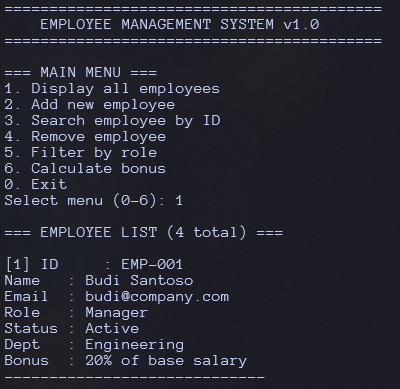
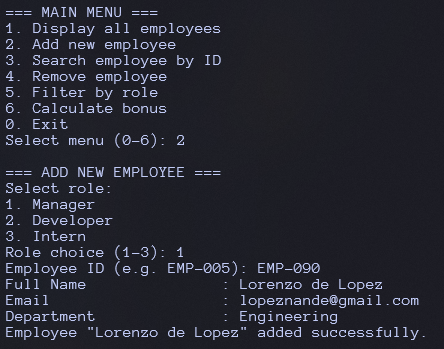
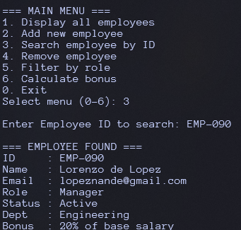

# Study Case: Employee Management System

**Theme**  
An employee management system in a company that handles various types of employees: Manager, Developer, and Intern.

**Learning Objectives**  
Combine all OOP concepts that have been learned:
- Class & Object  
- Encapsulation (private data + getter/setter + validation)  
- Inheritance (superclass & subclass)  
- Polymorphism (method overriding + runtime polymorphism via superclass reference)  

---

## Screenshots

### 1. Display All Employees


### 2. Add New Employee


### 3. Search Employee by ID


---

## Folder Structure

```
employee/
├── manager/                         # Encapsulation + CRUD logic
│   └── EmployeeManager.java
├── model/                          # Abstract superclass (Abstraction)
│   └── Employee.java
├── role/                           # Inheritance + Polymorphism
│   ├── Manager.java
│   ├── Developer.java
│   └── Intern.java
└── MainEmployee.java               # Demo of all concepts
```

---

## Detailed Specifications

### 1. Abstract Class `Employee` (Superclass)

- **Attributes** (protected):
  - `String id`
  - `String name`
  - `String email`
  - `boolean isActive` (default = true)

- **Constructor**:
  - Accepts `id`, `name`, and `email`
  - Calls setters for `name` and `email` to ensure validation during instantiation

- **Methods**:
  - `void activate()` → set `isActive` to `true`
  - `void deactivate()` → set `isActive` to `false`
  - `abstract String getRoleName()` → must be implemented by subclass, returns role name
  - `abstract double calculateBonus(double baseSalary)` → must be implemented by subclass, returns bonus amount
  - `void displayInfo()` → display id, name, email, role, and active status (can be overridden)

- **Setter with validation**:
  - `setName(String name)` → if null/empty → throw `IllegalArgumentException`
  - `setEmail(String email)` → if email does not contain `@` → throw `IllegalArgumentException`

---

### 2. Subclasses (Inheritance + Polymorphism)

| Class       | Additional Attributes         | Bonus                     | Extra Override in `displayInfo()` |
|-------------|------------------------------|---------------------------|-----------------------------------|
| `Manager`   | `String department`          | 20% of base salary        | Show department                   |
| `Developer` | `String programmingLanguage` | 15% of base salary        | Show programming language         |
| `Intern`    | `String university`, `int durationMonths` | 5% of base salary | Show university & duration        |

> **Note for `Intern`:** `durationMonths` must be validated in setter — if outside 1–12 → throw `IllegalArgumentException`.

---

### 3. Class `EmployeeManager` (Encapsulation + CRUD)

Manages employee collection using a static array with a maximum capacity of 50.

- **Private attributes**:
  - `Employee[] employeeList` — storage array
  - `int count` — current number of employees
  - `int MAX_CAPACITY = 50`

- **Key methods**:

| Method | Function |
|--------|--------|
| `addEmployee(Employee emp)` | Add new employee; check duplicate ID |
| `findById(String id)` | Find employee by ID (case-insensitive) |
| `removeEmployee(String id)` | Remove employee and shift array |
| `displayAll()` | Display all employees |
| `displayByRole(String roleName)` | Filter employees by role |
| `displayBonus(String id, double baseSalary)` | Show calculated bonus |

---

### 4. In `MainEmployee.java` (Demo)

**Preloaded sample data:**

```java
new Manager("EMP-001", "Budi Santoso", "budi@company.com", "Engineering")
new Developer("EMP-002", "Rina Wijaya", "rina@company.com", "Java")
new Developer("EMP-003", "Andi Nugroho", "andi@company.com", "Python")
new Intern("EMP-004", "Siti Rahma", "siti@company.com", "Universitas Brawijaya", 6)
```

---

### Available Menu

```
=== MAIN MENU ===
1. Display all employees
2. Add new employee
3. Search employee by ID
4. Remove employee
5. Filter by role
6. Calculate bonus
0. Exit
```

---

### Add Employee Flow (Menu 2)

1. User selects role first (Manager / Developer / Intern)  
2. Input general fields: ID, Name, Email  
3. Input additional fields based on role  
4. Validation runs automatically via setter in constructor  

---

### Remove Employee Flow (Menu 4)

1. Display all employees  
2. User inputs ID to remove  
3. Confirmation `(y/n)` before deletion  

---

### Calculate Bonus Flow (Menu 6)

1. Input employee ID  
2. Input base salary  
3. System calculates bonus based on role percentage  

---

## OOP Concepts Implemented

| Concept | Implementation |
|--------|--------------|
| **Encapsulation** | Protected attributes with validated setters; `EmployeeManager` hides internal array |
| **Inheritance** | `Manager`, `Developer`, `Intern` extend `Employee` |
| **Polymorphism** | `getRoleName()` and `calculateBonus()` overridden; `displayInfo()` called via `Employee[]` reference |
| **Abstraction** | `Employee` is abstract; cannot be instantiated directly |

---

## Compile & Run

```bash
# Compile all Java files
javac -d out $(find src -name "*.java")

# Run program
java MainEmployee.java
```
